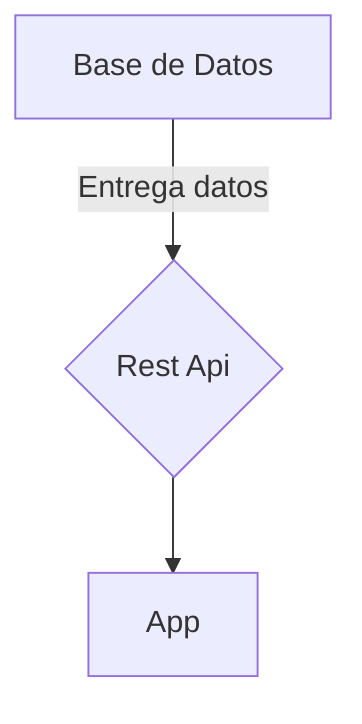

# AUTO QR - Documentación
## Docker
### Instalación
Pasos previos a la instalacion de docker.
```
sudo apt-get install  curl apt-transport-https ca-certificates software-properties-common
```
```
curl -fsSL https://download.docker.com/linux/ubuntu/gpg | sudo apt-key add -
```
```
sudo add-apt-repository "deb [arch=amd64] https://download.docker.com/linux/ubuntu $(lsb_release -cs) stable"
```

En caso de estar usando Ubuntu, la instalación se logra simplemente con el comando
```
sudo apt install docker-ce
```
```
sudo docker run hello-world
```

Instalacion de guess additions
```
sudo apt install gcc make perl
```

```
sudo ./VBoxLinuxAdditions.run
```
Iniciar ignition con docker
```
docker run -d -p 9088:8088 --name ignition-test inductiveautomation/ignition:8.1.26 \
    -n docker-test -a localhost -h 9088 -s 9043
```
Comandos
```
sudo docker stop ignition-test
```
```
sudo docker container prune
```
*en construicción*

## Diagrama de la solución


